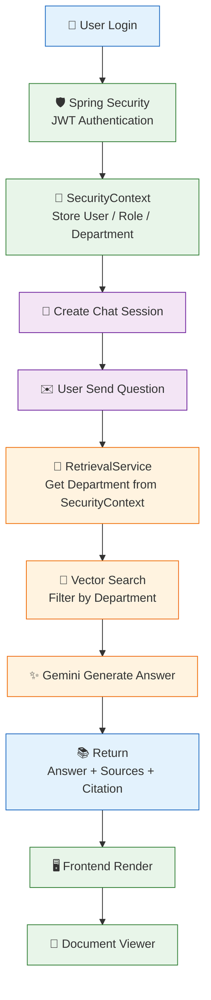

# Chat Flow - IDMS (Authentication + RAG + Citation)



---

# Luồng xử lý

```
User Login
      │
      ▼
Spring Security
      │
      ▼
SecurityContext
      │
      ▼
Create Chat Session
      │
      ▼
User Send Question
      │
      ▼
RetrievalService
(Get Department from SecurityContext)
      │
      ▼
Vector Search
(Filter by Department)
      │
      ▼
Gemini Generate Answer
      │
      ▼
Answer + Sources + Citation
      │
      ▼
Frontend Render
      │
      ▼
Document Viewer
```

---

# Ý nghĩa từng bước

| Bước                        | Chức năng                                  |
| --------------------------- | ------------------------------------------ |
| User Login                  | Người dùng đăng nhập                       |
| Spring Security             | Xác thực JWT                               |
| SecurityContext             | Lưu User, Role, Department                 |
| Create Chat Session         | Tạo hoặc lấy cuộc hội thoại                |
| User Send Question          | Người dùng gửi câu hỏi                     |
| RetrievalService            | Lấy Department từ SecurityContext          |
| Vector Search               | Chỉ tìm tài liệu thuộc Department của User |
| Gemini Generate Answer      | Sinh câu trả lời từ Context                |
| Answer + Sources + Citation | Trả lời kèm nguồn trích dẫn                |
| Frontend Render             | Hiển thị kết quả                           |
| Document Viewer             | Click citation để mở tài liệu              |

---

# Điểm quan trọng của hệ thống

- SecurityContext là nguồn dữ liệu xác thực duy nhất.
- Department **không lấy từ Request**.
- Vector Search luôn lọc theo Department trước khi tính Similarity.
- Gemini chỉ nhận Context sau khi đã phân quyền.
- Citation được lưu trong `message_file_refs`.
- Người dùng chỉ xem được tài liệu thuộc phòng ban của mình.
